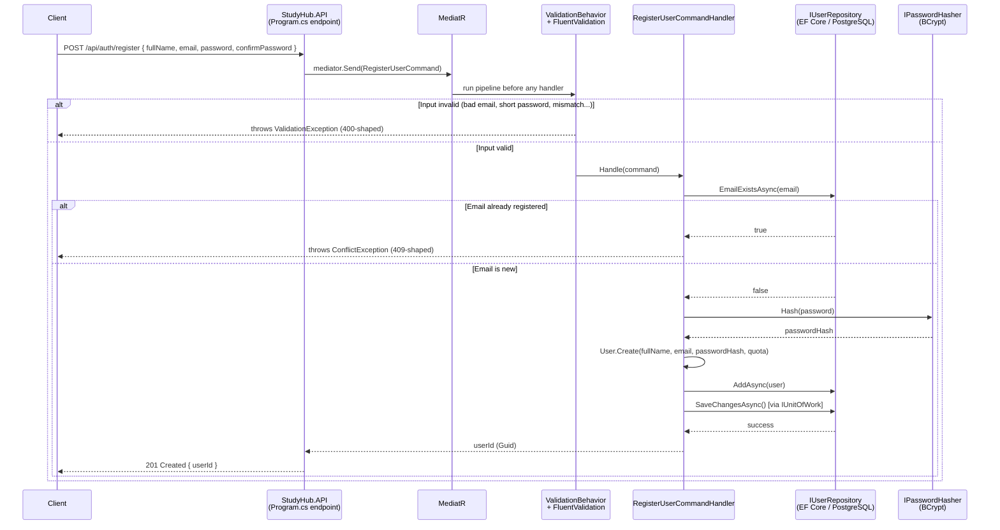

# StudyHub — Architecture & Technology Guide

> This document explains **how** StudyHub is built and **why**, so that anyone opening this repository — including "future you" in six months — can understand it without re-reading every commit.
>
> For **what** the system does (use cases, roadmap), see [`docs/Requirements.md`](docs/Requirements.md).
> For **code style rules**, see [`docs/CODING_STANDARDS.md`](docs/CODING_STANDARDS.md).

---

## 1. What Is This Project

StudyHub is a backend API for managing courses, tasks, and notes, with AI-assisted note-to-task extraction. It is a **personal learning project**: the explicit goal is to practice professional .NET backend patterns (Clean Architecture, CQRS, TDD-adjacent workflows) correctly — not to ship the fastest possible MVP.

Every technology choice below was made deliberately, usually after weighing at least one alternative, because the point of the project is to understand *why* a pattern exists, not just copy it.

---

## 2. Solution Structure

```
StudyHub/
├── StudyHub.Domain             → Business entities & rules. Zero external dependencies.
├── StudyHub.Application        → Use cases (Commands/Queries + Handlers). Depends only on Domain.
├── StudyHub.Infrastructure     → EF Core, PostgreSQL, external service implementations.
├── StudyHub.API                → ASP.NET Core host. Thin — no business logic.
├── StudyHub.Domain.Tests       → Unit tests for entity business rules.
├── StudyHub.Application.Tests  → Unit tests for Command/Query Handlers (mocked dependencies).
└── docs/                       → Requirements, coding standards, ERD.
```

**The dependency rule**: arrows only point inward.
`API → Infrastructure → Application → Domain`. Domain never knows Infrastructure, EF Core, or ASP.NET Core exist. This is what makes the business logic (Domain + Application) testable in milliseconds, with no database, no web server — see Section 5.

---

## 3. Technology Stack & Why Each One Was Chosen

### Domain Layer — Plain C# / .NET 10
**What**: Entities (`User`, `Course`, `TaskItem`, `Note`...) with private setters and static factory methods (`User.Create(...)`) that enforce invariants at creation time (e.g., a task title can never be empty).
**Why**: This is "Persistence Ignorance" — the Domain layer has *zero* NuGet dependencies beyond the base class library. It doesn't know EF Core or Postgres exist. That means the core business rules can be unit-tested with no infrastructure spun up at all, and could theoretically be reused with a completely different database or framework.

### Architecture — Clean Architecture (4 layers)
**Why chosen over a simpler 3-layer / N-Tier approach**: separates *what the business does* (Domain/Application) from *how it's technically implemented* (Infrastructure/API). The practical payoff, proven in this project already: when we needed to add Foreign Keys after the fact, or swap how a connection string is resolved, **zero lines changed in Domain or Application** — only Infrastructure moved.

### Database — PostgreSQL 15
**Why**: Free, open-source, strong relational integrity guarantees (exactly what this project leans on — see the 8 Foreign Keys enforced at the DB level in `docs/database/databaseERD`), and runs identically in Docker locally as it would in most cloud hosts.

### ORM — EF Core (Code-First) + Npgsql
**Why Code-First over Database-First**: the C# entities are the source of truth; the database schema is *generated* from them via Migrations. This keeps schema history versioned in git alongside the code that depends on it, instead of living only inside the database.
**Configuration style**: Fluent API only (`IEntityTypeConfiguration<T>`, one file per entity) — no Data Annotations on Domain entities, to keep persistence concerns (max lengths, indexes, delete behavior) out of the Domain layer entirely.

### Application Pattern — MediatR (CQRS)
**What**: every use case is one `Command` (writes) or `Query` (reads) object, plus one dedicated `Handler`. The API layer never contains business logic — an endpoint's entire body is "build a Command, send it, return the result."
**Why chosen over a traditional Service Layer** (`CourseService`, `TaskService`...): CQRS keeps each use case in its own small, isolated file (a "vertical slice"), which means:
- No shared "god service" class that grows forever as features are added.
- Cross-cutting behavior (validation, logging, future: authorization) can be inserted once as a **pipeline behavior** that wraps *every* Command/Query automatically, instead of being duplicated inside each service method.
- Each handler has exactly one reason to change — a direct application of the Single Responsibility Principle.

> **A note on licensing**: MediatR became a dual-licensed product starting with v13 (mid-2025), free for personal, educational, and small-revenue use, paid for larger commercial deployments. This project is well within the free tier. The startup log prints an informational warning about this — it is expected and has no functional effect.

### Validation — FluentValidation
**What**: validation rules live in a separate `Validator` class next to each Command (e.g., `RegisterUserCommandValidator`), not inline in the Handler.
**Why**: validation rules are declarative and independently testable, and — critically — they run **automatically** via a MediatR `ValidationBehavior` before any Handler executes. A Handler can assume its input is already valid; it never contains defensive `if (...) throw` checks.

### Password Hashing — BCrypt.Net-Next
**Why BCrypt over a hand-rolled hash**: BCrypt has a built-in configurable work factor (currently `12`), meaning hashing can be made deliberately slower as hardware gets faster, which is the whole point of a password hash (it must resist brute-force). It is battle-tested across essentially every programming language, not a .NET-specific concept.
**A gotcha worth documenting**: this library's namespace and its main class are both literally named `BCrypt` (`BCrypt.Net.BCrypt`), which breaks a plain `using BCrypt.Net;` import. The codebase uses an explicit alias instead:
```csharp
using BC = BCrypt.Net.BCrypt;
...
BC.HashPassword(password, WorkFactor);
```

### Testing — xUnit + Moq + FluentAssertions
**Why this combination**: xUnit is the de facto standard .NET test runner. Moq lets Handler tests fake repository interfaces (`IUserRepository`, `IUnitOfWork`) so a test like "registering with a duplicate email throws `ConflictException`" runs in milliseconds with **no real database connection** — it only needs the Handler and its interfaces, both of which live in Application/Domain, dependency-free. FluentAssertions makes assertions read close to English (`result.Should().NotBeEmpty()`), which pays off directly when a test fails and you're reading the message at 2am.
**What is *not* unit-tested (yet)**: EF Core queries (Infrastructure) and HTTP behavior (API) require a different technique — Integration Testing against a real or containerized database — planned for a later milestone, not needed for the current test suite.

### Containerization — Docker Compose (local Postgres only)
**Why**: guarantees every environment (this machine, a teammate's machine, CI later) runs the exact same Postgres version without a manual local install. The application itself (`StudyHub.API`) is **not yet containerized** — it currently runs directly via `dotnet run` — Postgres is the only piece running in Docker at this stage.

---

## 4. Request Lifecycle — Worked Example: User Registration

This is the one use case fully implemented end-to-end today (`POST /api/auth/register`). Every future use case (create a course, add a task...) will follow the **exact same shape** — this is the payoff of the CQRS pattern: learn the flow once, reuse it everywhere.



**Why this shape matters beyond registration**: notice that `RegisterUserCommandHandler` never touches HTTP, never touches SQL directly, and never decides *how* a password is hashed — it only orchestrates interfaces (`IUserRepository`, `IPasswordHasher`, `IUnitOfWork`) that Infrastructure provides at runtime via Dependency Injection. A `CreateCourseCommandHandler` built next month will look structurally identical, just with different interfaces and a different entity.

---

## 5. Why the Business Logic Is Fast to Test

Because Domain and Application have no dependency on a running database or web server, the entire business-rule test suite runs in about two seconds, with Docker not even needed to be running:

```bash
dotnet test
```

This is a direct, measurable payoff of the architecture — not a theoretical one. Compare that to the manual `.http` file tests, which require Postgres running, the API running, and manual inspection of each response — necessary for true end-to-end confidence, but far too slow to run on every change.

---

## 6. Getting Started

```bash
# 1. Start PostgreSQL
docker compose up -d

# 2. Apply the database schema
dotnet ef database update --project StudyHub.Infrastructure --startup-project StudyHub.API

# 3. Run the API
dotnet run --project StudyHub.API

# 4. Run the business-logic test suite
dotnet test
```

Manual endpoint testing: open `StudyHub.API/StudyHub.API.http` in Visual Studio or VS Code (with the REST Client extension) and use the "Send Request" links above each request.

---

## 7. Current State & Known Technical Debt

Being direct about this on purpose — a learning project is more useful when its gaps are documented, not hidden:

- **Global Exception Handling middleware does not exist yet.** `ConflictException` and `ValidationException` currently surface as raw 500 errors with a stack trace (visible only in Development). Planned for a later milestone; until then, this is expected behavior, not a bug.
- **Only registration (UC-01, half) is implemented.** Login, JWT issuance, and Refresh Token rotation are not built yet.
- **No Integration Tests yet** — only Domain and Application are unit-tested. Infrastructure (real EF Core queries against Postgres) and API (real HTTP round-trips) are untested by automation so far.
- **The API is not containerized** — only the database runs in Docker today.

Full milestone-by-milestone roadmap: see [`docs/Requirements.md`](docs/Requirements.md), Section 8.
