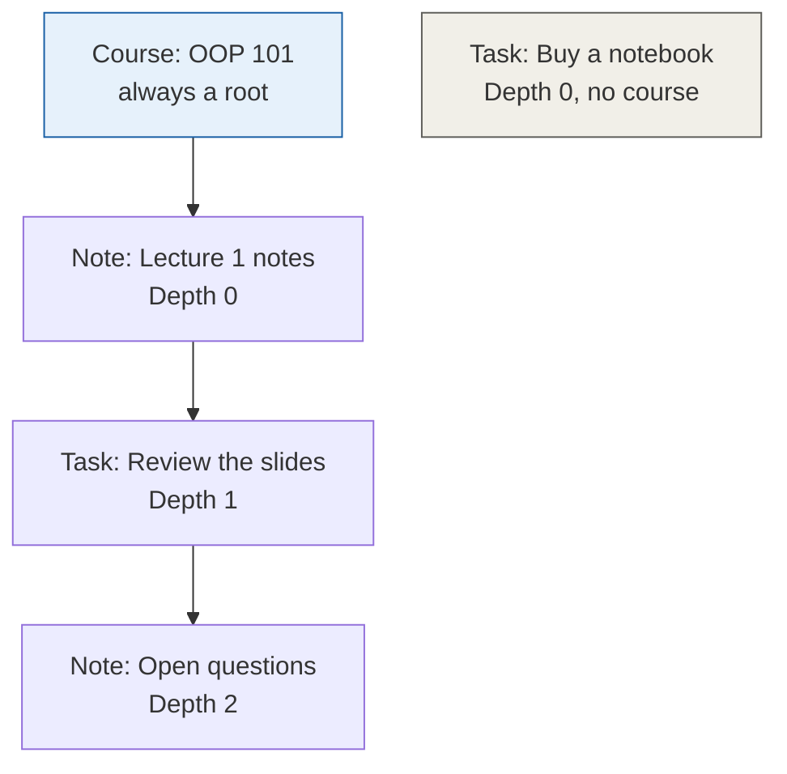
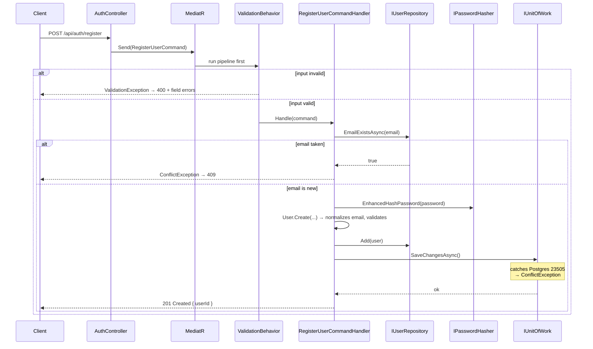
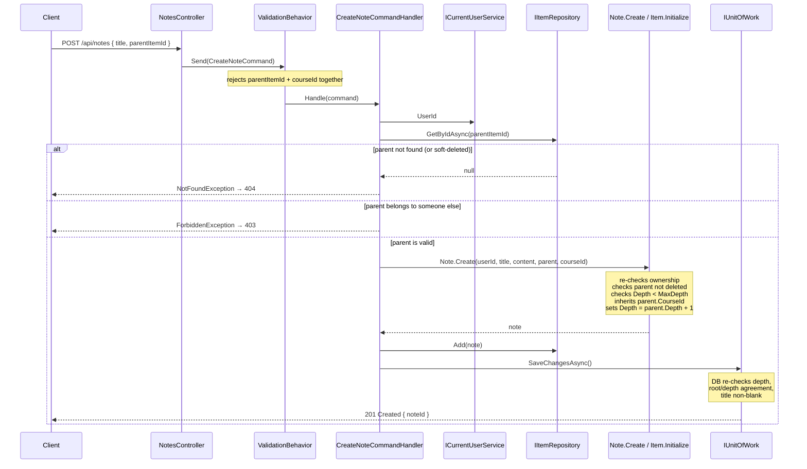
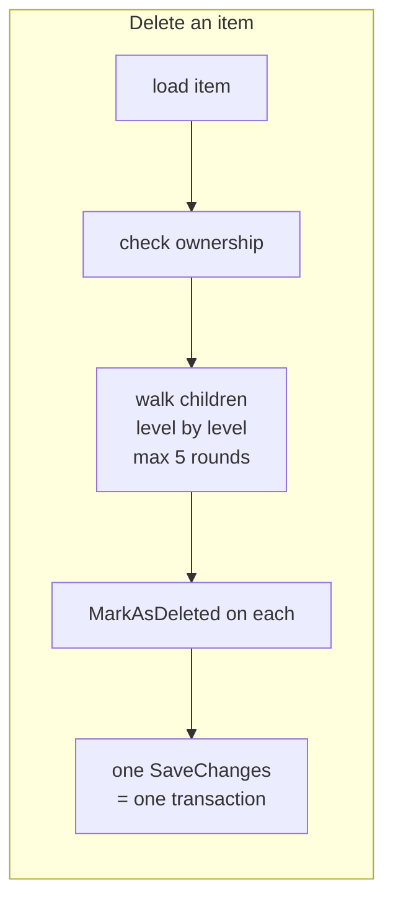
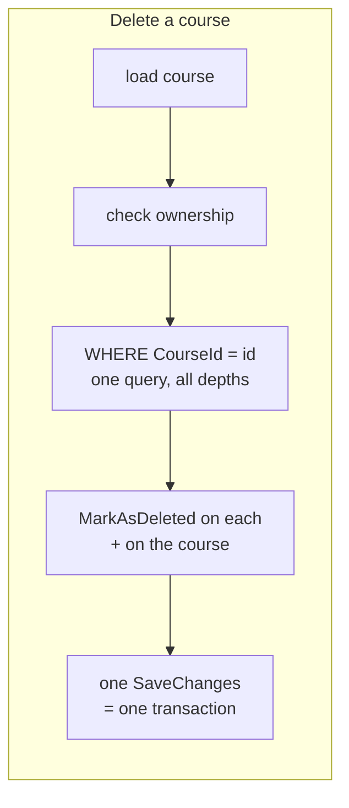
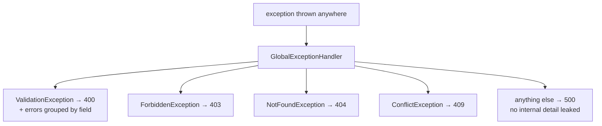
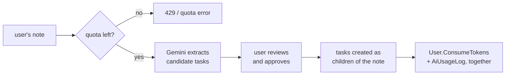

# StudyHub — Architecture & Technology Guide

> This document explains **how** StudyHub is built and **why**, so anyone opening this repository — including "future you" in six months — can understand it without re-reading every commit.
>
> For **what** the system does (use cases, business rules, schema, roadmap), see [`Requirements.md`](Requirements.md).
> For **code style rules**, see [`CODING_STANDARDS.md`](CODING_STANDARDS.md).
> For **problems hit and how they were fixed**, see [`TROUBLESHOOTING.md`](TROUBLESHOOTING.md).
>
> **v2.0** — rewritten after the M5 restructure. The `Notes` and `Tasks` tables described in v1 no longer exist.

---

## 1. What Is This Project

StudyHub is a backend API for managing courses, notes, and tasks, with AI-assisted extraction of tasks from raw notes.

It is a **personal learning project**. The goal is to practise professional .NET backend patterns correctly — Clean Architecture, CQRS, rich domain models, real schema constraints, and a disciplined verification habit — not to ship the fastest possible MVP.

Every technology choice below was made deliberately, usually after weighing at least one alternative, because the point is to understand *why* a pattern exists rather than to copy it.

---

## 2. Solution Structure

```
StudyHub/
├── StudyHub.Domain             → Business entities & rules. Zero external dependencies.
├── StudyHub.Application        → Use cases (Commands/Queries + Handlers). Depends only on Domain.
├── StudyHub.Infrastructure     → EF Core, PostgreSQL, security implementations.
├── StudyHub.API                → ASP.NET Core host. Thin — no business logic.
├── StudyHub.Domain.Tests       → Unit tests for entity rules.
├── StudyHub.Application.Tests  → Unit tests for handlers, dependencies mocked.
└── docs/                       → Requirements, architecture, standards, troubleshooting, ERD.
```

**The dependency rule**: arrows only point inward.

```
API → Infrastructure → Application → Domain
```

Domain never knows that EF Core, ASP.NET Core, or PostgreSQL exist. Application knows none of them either — it declares interfaces and lets Infrastructure supply the implementations.

**This rule is enforced by the compiler, not by discipline.** A repository implementation once landed in `StudyHub.Application` by mistake; it failed to build immediately, because that project has no reference to EF Core and therefore no `DbContext` type. The architecture caught the error rather than merely discouraging it.

---

## 3. Technology Stack & Why Each One Was Chosen

### Domain — plain C# / .NET 10

Entities with private setters, private constructors, and static factory methods that enforce invariants at creation time.

**Structure:**

```
BaseEntity            → Id, CreatedAt
└── AuditableEntity   → + UpdatedAt
    ├── User
    ├── Course
    ├── RefreshToken
    └── Item (abstract)
        ├── Note
        └── TaskItem

BaseEntity
└── AiUsageLog        → inherits the plain base: written once, never modified
```

The base class is split because a usage log is not an editable entity. Giving it `UpdatedAt` would create a column guaranteed to stay null forever. **Inheritance follows lifecycle, not convenience.**

**Value object**: `Email` owns normalization and format checking. It exists because that logic was previously written twice — in `User.Create` and in `UserRepository` — and a divergence between the two would let a duplicate account walk straight past a unique index.

**Clock handling**: methods whose behaviour depends on time (`User.ResetQuotaIfNeeded`, `RefreshToken.IsActive`, `RefreshToken.Revoke`) take `utcNow` as a parameter, so they are testable with no clock abstraction. Everything else reads `DateTime.UtcNow` directly. This is a deliberate limit: a full `TimeProvider` injection across every entity would touch every call site and every test to buy testability in places nobody tests.

**Why zero dependencies**: persistence ignorance. The business rules can be unit-tested with no infrastructure at all, and would survive a change of database or framework.

### Architecture — Clean Architecture, 4 layers

**Chosen over a simpler 3-layer approach** to separate *what the business does* from *how it is technically implemented*. The payoff has been concrete twice in this project: adding foreign keys after the fact, and swapping how the connection string is resolved, both changed **zero lines** in Domain or Application.

### Database — PostgreSQL 15

Free, strong relational guarantees, and identical behaviour in local Docker and in most cloud hosts. The project leans on those guarantees heavily: six foreign keys and six check constraints are enforced by the database, not only by code.

### ORM — EF Core 10 (Code-First) + Npgsql

**Code-First over Database-First**: the C# entities are the source of truth and the schema is generated from them, so schema history lives in git beside the code that depends on it.

**Configuration style**: Fluent API only (`IEntityTypeConfiguration<T>`, one file per entity). No Data Annotations on domain entities — persistence concerns stay out of the Domain project entirely.

**Table-Per-Hierarchy (TPH)**: `Note` and `TaskItem` are distinct C# classes stored in one `Items` table with an integer `Kind` discriminator. See §6 for the full explanation.

**A trap worth knowing**: EF's global query filters (`!IsDeleted`) apply to LINQ only. Any raw SQL bypasses them completely.

### Application pattern — MediatR 14 (CQRS)

Every use case is one `Command` or `Query` plus one dedicated `Handler`. A controller action's entire body is "build a command, send it, map the result".

**Chosen over a traditional service layer** (`CourseService`, `TaskService`…) because:
- No shared god-class that grows forever.
- Cross-cutting behaviour is inserted once as a pipeline behaviour wrapping *every* request, instead of being repeated inside each service method.
- Each handler has exactly one reason to change.

> **Licensing**: MediatR became dual-licensed from v13 (2025) — free for personal, educational, and small-revenue use. This project is well inside the free tier. The informational warning printed at startup is expected and has no functional effect.

### Validation — FluentValidation 12

Rules live in a `Validator` class next to each command, not inside the handler. They run **automatically** through `ValidationBehavior` before any handler executes, so a handler may assume its input is already valid and never contains defensive `if (...) throw` checks.

The behaviour runs all validators in parallel via `Task.WhenAll` and forwards the `CancellationToken` — the synchronous `Validate()` would violate the async standard in `CODING_STANDARDS.md` §2 on the one piece of code that runs for every single request.

### Password hashing — BCrypt.Net-Next

**Why BCrypt**: a configurable work factor (currently `12`) means hashing can be made slower as hardware gets faster, which is the entire point of a password hash.

**Why the `Enhanced` variants specifically**: plain BCrypt silently truncates its input at 72 bytes. Two long passwords sharing their first 72 bytes would authenticate each other, with no error anywhere. `EnhancedHashPassword` / `EnhancedVerify` pre-hash the input, so the limit disappears.

```csharp
using BC = BCrypt.Net.BCrypt;
...
BC.EnhancedHashPassword(password, WorkFactor);
```

**This choice is irreversible.** Standard and enhanced hashes are not interchangeable; switching after real accounts exist would lock every user out.

**Two gotchas**: the library's namespace and its main class are both named `BCrypt`, which breaks a plain `using BCrypt.Net;` — hence the alias above. And `Verify` throws `SaltParseException` on a malformed stored hash, so it is wrapped to return `false` instead of turning a rejected login into a 500.

### Refresh token hashing — SHA-256, not BCrypt

Refresh tokens are stored hashed, but with a **deterministic** hash. Every refresh looks the token up by its hash, and BCrypt's per-row salt would make that lookup impossible — it would require scanning the entire table.

SHA-256 is safe here precisely because a refresh token is high-entropy random data, unlike a human-chosen password.

### Testing — xUnit + Moq + FluentAssertions

Moq fakes the interfaces declared in Application, so a test like "creating an item under another user's parent throws `ForbiddenException`" runs in milliseconds against no database. FluentAssertions makes failures readable at 2am.

**Not automated yet**: EF Core queries and HTTP round-trips need integration testing against a containerized database — scheduled for M10.

### Containerization — Docker Compose (PostgreSQL only)

Guarantees an identical Postgres version everywhere without a local install. The API itself is **not yet containerized**; it runs via `dotnet run`.

---

## 4. How the System Works

This section is the mental model. Read it before reading any handler.

### 4.1 The content model

Three content types, two tables.



Read the middle branch carefully: a **task nested under a note**, and a **note nested under that task**. Free nesting in both directions is the whole point of the design, and it is what made a single `Items` table necessary.

`Buy a notebook` shows the other valid shape — a standalone root belonging to no course at all.

**Two independent axes**, not alternatives:
- `CourseId` — which course this belongs to (grouping)
- `ParentItemId` — which item this sits under (nesting)

A root item may have a course or not. A nested item **inherits** its parent's `CourseId` and cannot be given a different one.

### 4.2 Registration — implemented end to end



**Two conflict checks, on purpose.** The pre-check in the handler produces a friendly message. The unique index plus the `23505` translation in `UnitOfWork` is the actual protection — two simultaneous requests with the same email both pass the pre-check, and only the database can arbitrate.

**Why the `23505` translation lives in Infrastructure**: `PostgresException` is an Npgsql type. Catching it in a handler would make the Application layer aware of the database engine and break the dependency rule.

### 4.3 Creating a nested item — the richest flow



**Three layers guard the same rules, deliberately:**

| Layer | Checks | Why it exists |
|---|---|---|
| Validator | shape of the request | fails fast, before any I/O |
| Handler | parent exists, parent is owned | produces a precise 404 vs 403 |
| Entity | ownership, depth, deleted parent | **trusts no caller** — a handler that forgets cannot corrupt the tree |
| Database | depth range, root/depth agreement, title, enum ranges | protects against anything writing outside the application |

Duplication here is not waste. Each layer answers a different question: the handler answers *"what should the client be told?"*, the entity answers *"is this object valid?"*, the database answers *"is this row valid regardless of who wrote it?"*

### 4.4 Cascade delete — two shapes





**The course path needs no traversal at all.** Because every nested item inherits its root's `CourseId`, a flat `WHERE CourseId = @id` already returns the entire tree at every depth. That is the payoff of the deliberate duplication in ADR-09.

**Why no explicit transaction**: a single `SaveChangesAsync` call *is* one transaction in EF Core. Wrapping it in `BeginTransaction` would add nothing.

**Why level-by-level instead of `WITH RECURSIVE`**: depth is capped at five, so the walk costs at most five queries. Staying in LINQ keeps the soft-delete filter applied automatically and avoids a hand-maintained SQL string that EF would not filter at all.

### 4.5 How an exception becomes a status code



Every response is RFC 9457 `ProblemDetails`. Expected exceptions are logged as warnings; unexpected ones as errors with the full stack.

**The wiring trap**: `AddExceptionHandler<T>()` registers the handler, but nothing calls it without `app.UseExceptionHandler()` in the pipeline. Both compile and start cleanly either way.

**Two different sources produce 400.** Model binding inside `[ApiController]` rejects malformed JSON *before* MediatR runs, and its response carries a `traceId`. A validator's `ValidationException` does not. That difference is the fastest way to tell a bad payload from a broken rule.

### 4.6 The AI flow — planned (UC-06)



Two design points already settled:

**Provenance is parenthood.** An extracted task is simply a child of its source note. The old schema had a dedicated `Tasks.SourceNoteId` column; the tree makes it unnecessary.

**Human in the loop.** The AI suggests; the user approves; only then is anything written.

**The counter and the log must move together** — inside one method on `User` — or the fast quota check and the detailed history will drift apart.

---

## 5. The `Items` Table and TPH

The single most consequential decision in the codebase.

### The problem

A foreign key points at exactly one table. The requirement said a task's parent could be a course, a note, or another task — three tables. The relational model has no cheap way to express that.

### The alternatives, and what each cost

| Option | Shape | Cost |
|---|---|---|
| Polymorphic parent | `ParentId` + `ParentType` | **No foreign key at all.** Orphans accepted silently. Recursion spans two tables at every level |
| Exclusive arc | three nullable FK columns + a check | Six parent columns across two tables; the worst recursive query of the three |
| Single node table | one table, self-FK | Correct shape, but dissolves the domain model into wide nullable rows |

### The resolution

The cost was not the price of a *tree*. A tree over one type is a single nullable self-referencing column and nothing more. The cost was the price of a **contradiction**: types declared distinct while being required to nest interchangeably.

Unifying `Note` and `TaskItem` into one `Item` removed the contradiction rather than paying for it — and TPH kept the C# classes separate and rich while the database sees one table.

### What it bought

- A real self-referencing foreign key: `FK_Items_Items_ParentItemId`. The database refuses an orphaned parent reference.
- Free nesting in both directions, with no extra code.
- One-table recursion.
- `SourceNoteId` disappeared into ordinary parenthood.
- The note's awkward "title or content" constraint became a plain `Title NOT NULL`.

### What it cost

- `Status`, `Priority`, `DueDate` are nullable at the database level, so `CK_Item_TaskFields` replaces `NOT NULL`.
- Notes and tasks share one growing table.
- TPH is a concept you must understand before touching the configuration.

### How it is configured

```csharp
builder.HasDiscriminator<int>("Kind")
       .HasValue<Note>(0)
       .HasValue<TaskItem>(1);
```

An **integer** discriminator, not the default string: renaming a C# class later must not invalidate stored rows.

`DbSet<Item>` returns everything; `DbSet<Note>` and `DbSet<TaskItem>` filter by `Kind` automatically. **Repositories that resolve a parent must use `Items`** — a parent may be either type, and querying `Notes` would return `null` for every task parent, with no error and no clue.

### The six check constraints

| Name | What it stops |
|---|---|
| `CK_Item_Depth` | nesting past five levels |
| `CK_Item_RootDepth` | a root with depth, **and** a child without — one constraint, both directions |
| `CK_Item_TaskFields` | a note carrying task fields, or a task missing them |
| `CK_Item_StatusValue` | an out-of-range enum value; presence is not validity |
| `CK_Item_PriorityValue` | same, for priority |
| `CK_Item_Title` | a whitespace-only title, matching the domain's `IsNullOrWhiteSpace` |

`CK_Item_Title` uses a regex rather than `IS NOT NULL` because a check constraint that evaluates to `NULL` **passes** — the earlier null-only version accepted a title of three spaces.

---

## 6. Identity — Current State and Target

### ⚠ Authentication is not implemented

`CurrentUserService` reads an `X-User-Id` request header. **This is a complete authentication bypass**: anyone can name any user and become them. It exists only so the content handlers could be built and verified before M6.

**This code must not be deployed or exposed on any network until M6 is complete.**

### Why the shim is safe to have built on

The Application layer depends on `ICurrentUserService`, never on HTTP. When JWT arrives, only the API-layer implementation changes:

```
today:  header    → CurrentUserService → ICurrentUserService → handlers
M6:     JWT claim → CurrentUserService → ICurrentUserService → handlers
                                          ↑ unchanged
```

Not one line in Application, Domain, or Infrastructure moves. Every handler and every handler test written today survives.

### Ownership enforcement today

Parent-item ownership is checked **twice** — in the handler for a precise 403, and inside `Item.Initialize` because the entity trusts no caller.

Course ownership is checked in the handler **only**, because the entity receives a `Guid` rather than a `Course` object. This asymmetry is known and accepted; a future handler that forgets the check has no safety net beneath it.

---

## 7. Why the Business Logic Is Fast to Test

Domain and Application depend on no database and no web server, so the whole business-rule suite runs in about two seconds with Docker stopped:

```bash
dotnet test
```

Currently **43 tests** across the two projects.

This is a measurable payoff of the architecture, not a theoretical one. Compare it to the manual `.http` file, which needs Postgres running, the API running, and human inspection of each response — necessary for end-to-end confidence, far too slow for every change.

### Three verification rules, learned the hard way

1. **A successful build proves nothing.** Verify the specific effect: an HTTP status code, a row in `psql`, a passing test.
2. **Prove a constraint by breaking it *and* by inserting a row that should pass.** One without the other is half an answer — and read *which* constraint the error names. A malformed statement produces a red error and no inserted row, exactly like a working constraint does.
3. **A change with no externally observable behaviour is verified by reading the file.** When no code path calls the changed method yet, the build passes, the tests pass, and every endpoint behaves identically whether or not the change was ever applied. Nothing else will catch it.

---

## 8. Getting Started

```bash
# 1. Start PostgreSQL
docker compose up -d

# 2. Store the connection string for the running app (one time)
cd StudyHub.API
dotnet user-secrets init
dotnet user-secrets set "ConnectionStrings:DefaultConnection" \
  "Host=localhost;Port=5432;Database=StudyHubDb;Username=postgres;Password=YourSecurePassword"
cd ..

# 3. Set the environment variable for design-time commands (per terminal session)
#    PowerShell:  $env:STUDYHUB_DB_CONNECTION = "Host=localhost;..."
#    cmd.exe:     set "STUDYHUB_DB_CONNECTION=Host=localhost;..."

# 4. Apply the schema
dotnet ef database update --project StudyHub.Infrastructure --startup-project StudyHub.API

# 5. Run
dotnet run --project StudyHub.API

# 6. Test the business logic
dotnet test
```

### Two configuration paths that are not interchangeable

| Path | Reads from |
|---|---|
| The running app | `appsettings` → user secrets → DI |
| `dotnet ef` commands | `IDesignTimeDbContextFactory` → `STUDYHUB_DB_CONNECTION` |

**Migration commands succeeding says nothing about whether the app is configured**, and vice versa. Both must be set up, and only running the app tests the first.

The design-time factory has **no fallback value** — it throws with a clear message if the variable is missing. A fallback is how a password ends up committed.

### Manual endpoint testing

Open `StudyHub.API/StudyHub.API.http` in Visual Studio or VS Code with the REST Client extension. Register a user, copy the returned id into the `@userId` variable, and the content requests will work.

### Inspecting the database directly

```bash
docker exec -it studyhub_postgres psql -U postgres -d StudyHubDb
```

**`psql` is the stronger of the two manual tools**, because it is the only view that does not pass through EF's soft-delete filter. A soft-deleted row is invisible to the API and plainly visible here.

Paste one statement per line — a multi-line paste can merge with the previous statement and produce a syntax error that looks exactly like a constraint rejection.

---

## 9. Current State & Known Technical Debt

Documented on purpose. A learning project is more useful when its gaps are visible.

### Security
- **No authentication.** The `X-User-Id` header is a full bypass (§6). Highest-priority item; M6.
- **Registration conflict messages name the email**, enabling account enumeration. A known trade for a friendlier message.
- **Course ownership is guarded in one layer only** (§6).

### Functionality
- **No read queries at all.** Content can be created and deleted, but only inspected through `psql`.
- **No update handlers.** `UpdateStatus`, `UpdateContent`, `UpdateSchedule`, and `UpdateDetails` exist on the entities with nothing calling them — behaviour that is written but unreachable.
- **No DTOs.** Controllers return anonymous objects. `CODING_STANDARDS.md` §4 requires DTOs; needed before the first read query, since returning `Item` directly would leak every field.
- **`DefaultMonthlyTokenQuota` is a constant** in `RegisterUserCommandHandler` rather than configuration.

### Design limits
- **Node moving is not supported.** Three other decisions — stored depth, inherited `CourseId`, and the absence of cycle detection — are safe *only* because of this. Adding moving invalidates all three at once.
- **Correct restore is impossible as designed.** After a cascade delete, nothing distinguishes a child deleted deliberately from one deleted by cascade. Fixing it means `DeletedAt` instead of `IsDeleted` — cheap now, expensive once real data exists.
- **Repository + Unit of Work over EF Core is technically redundant.** `DbContext` is already a unit of work and `DbSet<T>` already a repository. Kept because the pattern is worth learning, at the cost of an extra abstraction and the loss of `IQueryable` composition at the boundary.

### Infrastructure
- **No integration tests.** Infrastructure and API are covered by manual verification only. M10.
- **The API is not containerized.** Only Postgres runs in Docker.
- **No rate limiting.** M10.

Full roadmap: [`Requirements.md`](Requirements.md) §11.
