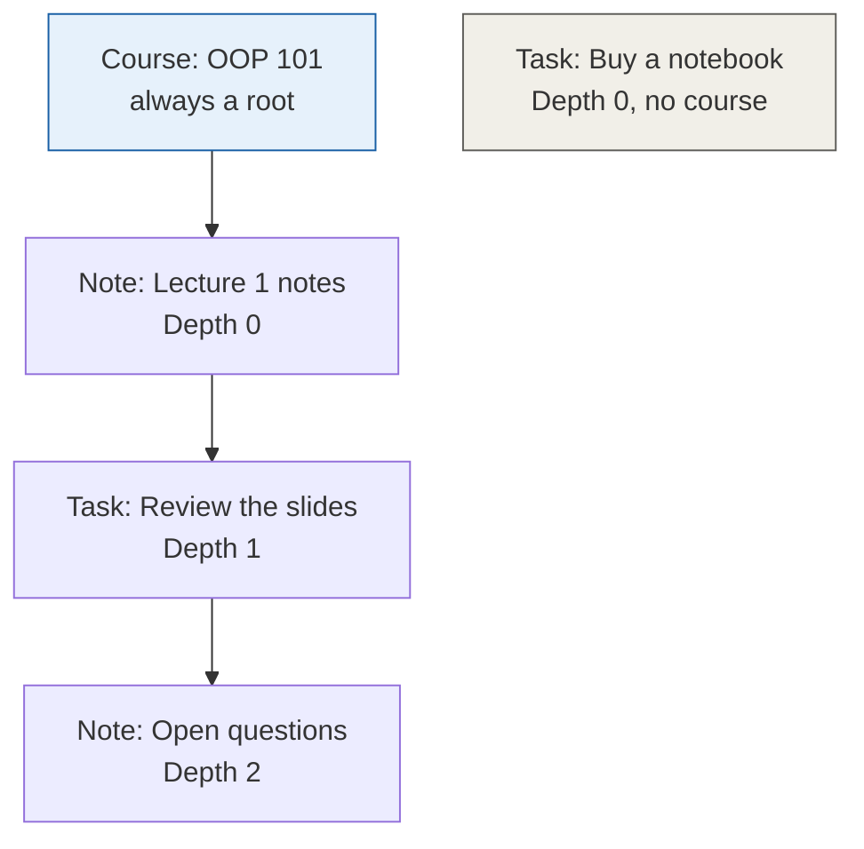
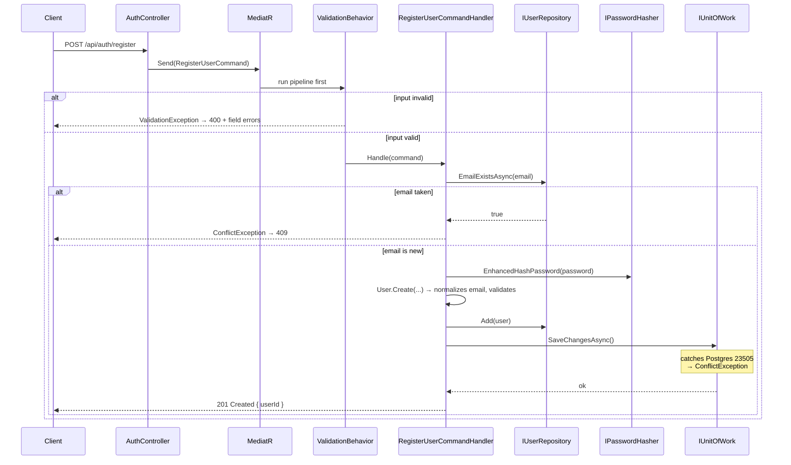
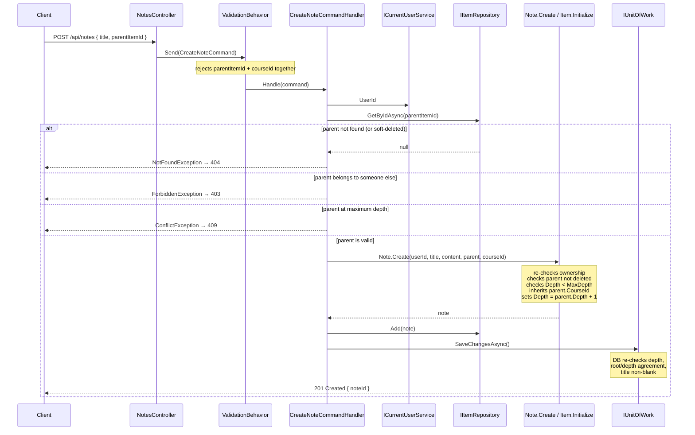
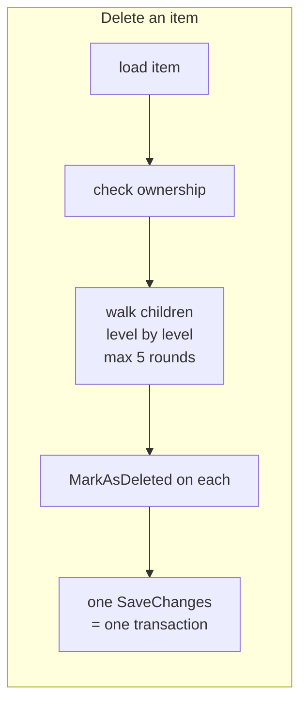
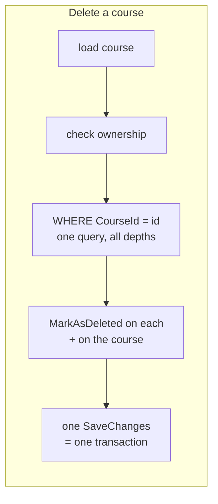
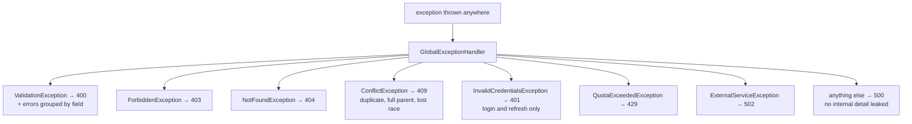
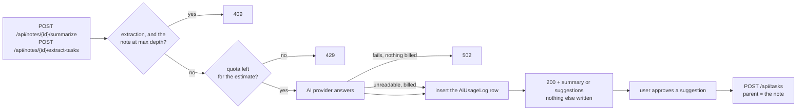
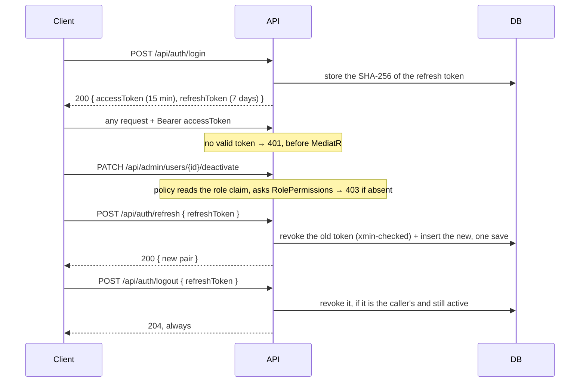

# StudyHub — Architecture & Technology Guide

> This document explains **how** StudyHub is built and **why**, so anyone opening this repository — including "future you" in six months — can understand it without re-reading every commit.
>
> For **what** the system does (use cases, business rules, schema, roadmap), see [`Requirements.md`](Requirements.md).
> For **problems hit and how they were fixed**, see [`TROUBLESHOOTING.md`](TROUBLESHOOTING.md).
>
> **v3.1** — aligned with `Requirements.md` v3.1: every milestone is complete, and this document describes the system as built. A milestone named in the text — *(M6)*, *(M10)* — says where something was built, never that it is missing.

---

## 1. What Is This Project

StudyHub is a backend API for managing courses, notes, and tasks, with AI summaries of notes and AI-suggested tasks extracted from them — suggestions the user approves before anything is written. The API also serves one demo page from `wwwroot`, so the whole system can be tried in a browser (Requirements ADR-48).

It is a **personal learning project**. The goal is to practise professional .NET backend patterns correctly — Clean Architecture, CQRS, rich domain models, real schema constraints, and a disciplined verification habit — not to ship the fastest possible MVP.

Every technology choice below was made deliberately, usually after weighing at least one alternative, because the point is to understand *why* a pattern exists rather than to copy it.

---

## 2. Solution Structure

```
StudyHub/
├── StudyHub.Domain             → Business entities & rules. Zero external dependencies.
├── StudyHub.Application        → Use cases (Commands/Queries + Handlers). Depends only on Domain.
├── StudyHub.Infrastructure     → EF Core, PostgreSQL, security implementations.
├── StudyHub.API                → ASP.NET Core host. Thin — no business logic.
├── StudyHub.Domain.Tests       → Unit tests for entity rules.
├── StudyHub.Application.Tests  → Unit tests for handlers, dependencies mocked.
├── StudyHub.Infrastructure.Tests → Unit tests for infrastructure code that needs no database.
└── docs/                       → Requirements, architecture, troubleshooting.
```

**The dependency rule**: arrows only point inward.

```
API → Infrastructure → Application → Domain
```

Domain never knows that EF Core, ASP.NET Core, or PostgreSQL exist. Application knows none of them either — it declares interfaces and lets Infrastructure supply the implementations.

**This rule is enforced by the compiler, not by discipline.** A repository implementation once landed in `StudyHub.Application` by mistake; it failed to build immediately, because that project has no reference to EF Core and therefore no `DbContext` type. The architecture caught the error rather than merely discouraging it.

---

## 3. Technology Stack & Why Each One Was Chosen

### Domain — plain C# / .NET 10

Entities with private setters, private constructors, and static factory methods that enforce invariants at creation time.

`Authorization/` holds the permission model: `Permissions` (string constants, one per capability) and `RolePermissions` (the role-to-capabilities map). Both are plain C# with no dependency, so the zero-dependency rule holds while ASP.NET Core still consumes the constants as policy names. **The map lives here, not in the API layer, so that one map has two callers** — the endpoint policy asks it from the `role` claim, and `User.Can` asks it from the entity. A map in the API layer would be invisible to Application, and a handler cannot ask a question it cannot see. The policy wiring lives in `StudyHub.API/Authorization/`; see Requirements §9.5 and ADR-31.

**Structure:**

```
BaseEntity            → Id, CreatedAt
└── AuditableEntity   → + UpdatedAt
    ├── User
    ├── Course
    ├── RefreshToken
    └── Item (abstract)
        ├── Note
        └── TaskItem

BaseEntity
└── AiUsageLog        → inherits the plain base: written once, never modified
```

The base class is split because a usage log is not an editable entity. Giving it `UpdatedAt` would create a column guaranteed to stay null forever. **Inheritance follows lifecycle, not convenience.**

**Value object**: `Email` owns normalization and format checking. It exists because that logic was previously written twice — in `User.Create` and in `UserRepository` — and a divergence between the two would let a duplicate account walk straight past a unique index. The EF Core converter rebuilds it through `Email.FromPersisted`, which does not validate — a converter is a mapping, not a gate, and one corrupt row must not turn every read of that user into a 500 (Requirements §3.3).

**Clock handling**: methods whose behaviour depends on time (`RefreshToken.IsActive`, `RefreshToken.Revoke`) take `utcNow` as a parameter, so they are testable with no clock abstraction. Everything else reads `DateTime.UtcNow` directly. A *period* is a separate question: which month an instant belongs to is answered by `BusinessCalendar` in Application, which converts a UTC instant into the configured business time zone (`BusinessTime:TimeZoneId`, Asia/Riyadh) and back, so a month begins at Riyadh midnight while everything stored and exchanged stays UTC (ADR-40). This is a deliberate limit: a full `TimeProvider` injection across every entity would touch every call site and every test to buy testability in places nobody tests.

**Why zero dependencies**: persistence ignorance. The business rules can be unit-tested with no infrastructure at all, and would survive a change of database or framework.

### Architecture — Clean Architecture, 4 layers

**Chosen over a simpler 3-layer approach** to separate *what the business does* from *how it is technically implemented*. The payoff has been concrete twice in this project: adding foreign keys after the fact, and swapping how the connection string is resolved, both changed **zero lines** in Domain or Application.

### Database — PostgreSQL 15

Free, strong relational guarantees, and identical behaviour in local Docker and in most cloud hosts. The project leans on those guarantees heavily: six foreign keys and six check constraints are enforced by the database, not only by code.

### ORM — EF Core 10 (Code-First) + Npgsql

**Code-First over Database-First**: the C# entities are the source of truth and the schema is generated from them, so schema history lives in git beside the code that depends on it.

**Configuration style**: Fluent API only (`IEntityTypeConfiguration<T>`, one file per entity). No Data Annotations on domain entities — persistence concerns stay out of the Domain project entirely.

**Table-Per-Hierarchy (TPH)**: `Note` and `TaskItem` are distinct C# classes stored in one `Items` table with an integer `Kind` discriminator. See §6 for the full explanation.

**A trap worth knowing**: EF's global query filters (`!IsDeleted`; `DeletedAt == null` is deferred, Requirements §12) apply to LINQ only. Any raw SQL bypasses them completely.

### Application pattern — MediatR 14 (CQRS)

Every use case is one `Command` or `Query` plus one dedicated `Handler`. A controller action's entire body is "build a command, send it, map the result".

**Chosen over a traditional service layer** (`CourseService`, `TaskService`…) because:
- No shared god-class that grows forever.
- Cross-cutting behaviour is inserted once as a pipeline behaviour wrapping *every* request, instead of being repeated inside each service method.
- Each handler has exactly one reason to change.

> **Licensing**: MediatR became dual-licensed from v13 (2025) — free for personal, educational, and small-revenue use. This project is well inside the free tier. The informational warning printed at startup is expected and has no functional effect.

### Validation — FluentValidation 12

Rules live in a `Validator` class next to each command, not inside the handler. They run **automatically** through `ValidationBehavior` before any handler executes, so a handler may assume its input is already valid and never contains defensive `if (...) throw` checks.

The behaviour runs all validators in parallel via `Task.WhenAll` and forwards the `CancellationToken` — the synchronous `Validate()` would violate the async standard in `CODING_STANDARDS.md` §2 on the one piece of code that runs for every single request.

### Password hashing — BCrypt.Net-Next

**Why BCrypt**: a configurable work factor (currently `12`) means hashing can be made slower as hardware gets faster, which is the entire point of a password hash.

**Why the `Enhanced` variants specifically**: plain BCrypt silently truncates its input at 72 bytes. Two long passwords sharing their first 72 bytes would authenticate each other, with no error anywhere. `EnhancedHashPassword` / `EnhancedVerify` pre-hash the input, so the limit disappears.

```csharp
using BC = BCrypt.Net.BCrypt;
...
BC.EnhancedHashPassword(password, WorkFactor);
```

**This choice is irreversible.** Standard and enhanced hashes are not interchangeable; switching after real accounts exist would lock every user out.

**Two gotchas**: the library's namespace and its main class are both named `BCrypt`, which breaks a plain `using BCrypt.Net;` — hence the alias above. And `Verify` throws `SaltParseException` on a malformed stored hash, so it is wrapped to return `false` instead of turning a rejected login into a 500.

### Refresh token hashing — SHA-256, not BCrypt

Refresh tokens are stored hashed, but with a **deterministic** hash. Every refresh looks the token up by its hash, and BCrypt's per-row salt would make that lookup impossible — it would require scanning the entire table.

SHA-256 is safe here precisely because a refresh token is high-entropy random data, unlike a human-chosen password.

### Access tokens — `Microsoft.IdentityModel.JsonWebTokens`

Login and refresh issue them; `JwtBearer` validates them on every request that is not marked anonymous. `POST /api/auth/login` verifies the password against BCrypt, checks `IsActive`, and returns a signed access token plus a refresh token whose SHA-256 hash is the only form stored. Every refusal — unknown email, wrong password, deactivated account — is the same 401 body, and `Verify` runs against a dummy hash even when no user was found, so the two cases cannot be told apart by response time.


Tokens are written with `JsonWebTokenHandler` — the handler `JwtBearer` has used to read them since ASP.NET Core 8. `System.IdentityModel.Tokens.Jwt` is the previous generation of the same library, and writing with one handler while reading with the other is a known source of claim-name surprises (Requirements ADR-29, §9.1).

### AI provider — plain HTTP through `Microsoft.Extensions.Http`

Gemini is called over its REST API with a typed `HttpClient` from `IHttpClientFactory`, and parsed with `System.Text.Json`. No provider SDK is taken: the request is one POST with a prompt, the response is one JSON document, and an SDK would add a dependency and its release cadence to save a few lines. The factory is taken, because a `HttpClient` per request exhausts sockets and caches DNS for the life of the process. See §4.6 for the boundary this sits behind (Requirements ADR-35).

### Concurrency — PostgreSQL `xmin`

Refresh token rotation reads a row and writes it back, so two parallel requests could both succeed and fork one session into two. PostgreSQL changes the hidden `xmin` column on every update; EF Core maps it as a shadow concurrency token, so the second save fails instead. No column is added and no Domain type gains a field (Requirements ADR-27, §14.4).

Proven, not assumed: with SQL command logging on, a rotation logs `UPDATE "RefreshTokens" SET ... WHERE "Id" = @p3 AND xmin = @p4`. The same log shows the revoke and the insert leaving as one command, which is why §9.3 forbids adding an explicit transaction on top of the single save.

### Testing — xUnit + Moq + FluentAssertions

Moq fakes the interfaces declared in Application, so a test like "creating an item under another user's parent throws `ForbiddenException`" runs in milliseconds against no database. FluentAssertions makes failures readable at 2am.

`StudyHub.Infrastructure.Tests` covers infrastructure code that needs no database — password hashing and token generation. Application tests never reference Infrastructure; the tests follow the same dependency rule as the code.

`StudyHub.IntegrationTests` covers what the unit suites cannot see: it hosts the real API in-process and runs it against a throwaway PostgreSQL container, so the SQL, the soft-delete filter, the dashboard's statement budget, rate limiting and the concurrency token are executed for real (§4.8, Requirements ADR-44).

### Containerization — Docker Compose

Guarantees an identical Postgres version everywhere without a local install. The API runs either with `dotnet run` or as a second compose service built from the repository's `Dockerfile`, with its secrets in a git-ignored `.env` (§4.8, Requirements ADR-47).

---

## 4. How the System Works

This section is the mental model. Read it before reading any handler.

### 4.1 The content model

Three content types, two tables.



Read the middle branch carefully: a **task nested under a note**, and a **note nested under that task**. Free nesting in both directions is the whole point of the design, and it is what made a single `Items` table necessary.

`Buy a notebook` shows the other valid shape — a standalone root belonging to no course at all.

**Two independent axes**, not alternatives:
- `CourseId` — which course this belongs to (grouping)
- `ParentItemId` — which item this sits under (nesting)

A root item may have a course or not. A nested item **inherits** its parent's `CourseId`; a request that sends a course together with a parent is rejected — any course, the parent's own included (Requirements rule 3.2.5).

### 4.2 Registration — implemented end to end



**Two conflict checks, on purpose.** The pre-check in the handler produces a friendly message. The unique index plus the `23505` translation in `UnitOfWork` is the actual protection — two simultaneous requests with the same email both pass the pre-check, and only the database can arbitrate.

**Why the `23505` translation lives in Infrastructure**: `PostgresException` is an Npgsql type. Catching it in a handler would make the Application layer aware of the database engine and break the dependency rule. The same place translates `DbUpdateConcurrencyException` into `ConflictException` as well (ADR-27).

### 4.3 Creating a nested item — the richest flow



**Three layers guard the same rules, deliberately:**

| Layer | Checks | Why it exists |
|---|---|---|
| Validator | shape of the request | fails fast, before any I/O |
| Handler | parent exists, is owned, has room | produces a precise 404, 403, or 409 |
| Entity | ownership, depth, deleted parent | **trusts no caller** — a handler that forgets cannot corrupt the tree |
| Database | depth range, root/depth agreement, title, enum ranges | protects against anything writing outside the application |

Duplication here is not waste. Each layer answers a different question: the handler answers *"what should the client be told?"*, the entity answers *"is this object valid?"*, the database answers *"is this row valid regardless of who wrote it?"*

**A rule is written once and asked twice** (ADR-30). The handler asks `parent.IsAtMaxDepth`; `Item.Initialize` asks the same member. Restating the condition in the handler would put the rule in two places, free to drift. Before this shape existed the handler did not ask at all, so the request reached the entity's guard and the client got a 500 — the A5 failure shape, now closed for this rule.

### 4.4 Cascade delete — two shapes





Stamping one `DeletedBatchId` on every row a delete operation touches, so a later restore can tell a cascade from a deliberate delete, is deferred (ADR-25, Requirements §12).

**The course path needs no traversal at all.** Because every nested item inherits its root's `CourseId`, a flat `WHERE CourseId = @id` already returns the entire tree at every depth. That is the payoff of the deliberate duplication in ADR-09.

**Why no explicit transaction**: a single `SaveChangesAsync` call *is* one transaction in EF Core. Wrapping it in `BeginTransaction` would add nothing.

**Why level-by-level instead of `WITH RECURSIVE`**: depth is capped at five, so the walk costs at most five queries. Staying in LINQ keeps the soft-delete filter applied automatically and avoids a hand-maintained SQL string that EF would not filter at all.

### 4.5 How an exception becomes a status code



Every response is RFC 9457 `ProblemDetails`. Expected exceptions are logged as warnings; unexpected ones as errors with the full stack.

**The other 401, and the permission 403, never reach this handler.** The authorization middleware rejects a missing or invalid access token (401), or a valid one whose role lacks the endpoint's permission (403), before MediatR runs. Both responses have an empty body.

**400 is shape; 403, 404 and 409 are state.** Validators throw the first; handlers throw the rest. A handler never throws `ValidationException` (Requirements §8).

**The wiring trap**: `AddExceptionHandler<T>()` registers the handler, but nothing calls it without `app.UseExceptionHandler()` in the pipeline. Both compile and start cleanly either way.

**Two different sources produce 400.** Model binding inside `[ApiController]` rejects malformed JSON *before* MediatR runs, and its response carries a `traceId`. A validator's `ValidationException` does not. That difference is the fastest way to tell a bad payload from a broken rule.

### 4.6 The AI flow (UC-06, UC-07)

Two operations on a note the user already saved, one paid call each (ADR-38):



**The provider boundary is one interface and one class.** Application declares `IAiService` with one method per operation — "summarize this note", "extract tasks from this note", never "complete this prompt". Everything Gemini knows about — the route, the key, the two prompts, the request and response JSON, and the `usageMetadata` field the token count is read from — lives inside `GeminiAiService` in Infrastructure. A second provider is therefore a second class and one line in `AddInfrastructureServices` (ADR-35). Both failure modes leave that class as `ExternalServiceException`, an Application type, for the same reason `PostgresException` never leaves the persistence code.

**The call goes through a typed `HttpClient` from `IHttpClientFactory`**, with the base address, the explicit timeout and the API-key header configured where the client is registered. A client constructed per request exhausts sockets and caches DNS for the life of the process, and the 100-second default timeout is the absence of a decision rather than one (§15.3).

**A reasoning model is assumed, not hoped against.** Such a model spends part of the output budget on thinking, and returns that thinking as extra response parts marked `thought`. Reading `parts[0].text` would therefore hand the model's reasoning back as if it were the answer, and when the budget is exhausted *while* thinking the provider returns a candidate with no answer parts at all — occasionally with no `content` object either. So every step of the walk down the response is optional, thought parts are skipped, and the remaining text is concatenated. How much a model may think is passed straight through from `Ai:ThinkingBudget` and `Ai:ThinkingLevel` and never invented: a model that does not know those fields refuses the entire request, so with both unset the request carries no thinking configuration at all.

**A failed first call has to be diagnosable.** A refusal logs its status *and* the first 500 characters of the body, which is where the provider names an unknown model or a rejected field; an unusable answer logs `finishReason`, and `MAX_TOKENS` logs the one sentence that identifies the cause — the budget ran out before the answer began. All of it at Warning, and none of it in the response body, which must never say which provider is behind the endpoint (§15.3).

**Without a key there is a fake provider, chosen once at startup.** `Ai:ApiKey` decides which implementation is registered, and the choice is logged by class name at startup. `FakeAiService` answers deterministically from the note itself, so both endpoints, the quota arithmetic and the 502 path can be exercised with no key, no network and no cost — and `Ai:FakeFailure` makes it fail on demand. It is never a fallback after a failed real call: a silent downgrade would make a broken provider look like a working one (ADR-35).

**Provenance is parenthood.** An approved task is simply a child of its source note. The old schema had a dedicated `Tasks.SourceNoteId` column; the tree makes it unnecessary.

**Human in the loop, with no endpoint of its own** (ADR-28). Extraction returns suggestions and writes nothing but the usage record. Approval is the existing `POST /api/tasks`. A summary is returned the same way and never stored: the client keeps it with `PATCH /api/items/{id}` or `POST /api/notes`, or pays again.

**Usage is recorded where it is paid, not where it is used.** An earlier version of this flow recorded tokens after the user approved — a user who never approved would have extracted for free. The record now follows the provider call directly, and never throws (ADR-24). A response that arrived but could not be read is recorded before the client is given its 502 (§15.3).

**The log is the only record of usage** (ADR-39). Until M8.1 a counter on `Users` was incremented in the same transaction as the `AiUsageLog` row, and it was reset lazily by the user's next AI call — so `GET /api/auth/me` reported last month's figure until that call, and the lazy reset raced the increment at the month boundary. The counter was a cached copy of a table that was already stored and indexed, so it was removed: a user's monthly usage is now the sum of their `AiUsageLogs` rows since the start of the month, recording is one insert that parallel operations can neither lose nor collide on, and there is nothing to reset. The month itself starts at midnight in Riyadh, not at UTC midnight three hours later (ADR-40). The rule and the record stay separate: `User.HasQuotaFor(used, estimate)` in Domain answers the question, and the inserted row is the record (ADR-24, Requirements §15.1).

### 4.7 The dashboard (UC-08)

```
GET /api/dashboard
  → DashboardController: send GetDashboardQuery, return Ok
  → GetDashboardQueryHandler: read the clock once, work out the window and the caps
  → IDashboardQueries.GetAsync(userId, criteria)
  → DashboardQueries: three statements — the counts, the urgent tasks, the recent courses
  → DashboardDto, or null → NotFoundException → 404
```

**The rules live in Application, the SQL in Infrastructure.** The handler owns every number of §15.4 — the three-day window, the cap of 10 urgent tasks, the cap of 5 recent courses — and hands them down as a `DashboardCriteria` record. Infrastructure decides nothing; it translates. That is what makes the rules testable without a database: the handler test asserts the literal window and the literal caps against a mocked interface, and it was watched failing before it was trusted (ADR-42).

**One instant per response.** The handler reads `DateTime.UtcNow` once. The overdue count, every `isOverdue` flag and the urgent window all come from that instant, and the response returns it as `generatedAt`. Two clock reads in one response could disagree with each other, and a dashboard that contradicts itself is worse than one that is a second old.

**The statement count is fixed, and that was proven, not asserted.** Every count is one statement anchored on the user's own row, with each number a correlated sub-count; the two lists are one statement each, sorted and limited in SQL. Three statements for a user with 11 items, three for the same user with 528 — counted in the EF Core SQL log on both sides, which is the only proof that means anything (§15.4). One statement for all the counts is also one snapshot, so the three task statuses always add up to the task total.

**A course's "latest activity" is the newest thing under it** (ADR-41), not the last time its own title changed: the later of `UpdatedAt ?? CreatedAt` on the course and the newest `UpdatedAt ?? CreatedAt` among its non-deleted items, at any depth. Because every item carries its root's `CourseId` (ADR-09), "at any depth" is one flat condition and the aggregate stays inside the same statement. Ticking a task therefore moves its course up the list, which is what a user means by "recent"; deleting an item is not activity, so a delete can move a course down.

**Never order by a nullable timestamp.** PostgreSQL sorts `NULL` first in a descending order, so ordering courses by `UpdatedAt DESC` would put every course that was never edited at the top — the newest-looking list being exactly the untouched ones. Both orderings here are on a coalesced value that cannot be null, and the `COALESCE` is visible in the logged SQL.

**404, not a dashboard of zeros**, when the token is valid but the account row is gone. Zeros are an answer; for an account that does not exist they would be a false one, and `GET /api/auth/me` already answers the same way.

### 4.8 The request pipeline, the cleanup job and the container (M10)

**The pipeline, in the order the middleware runs:**

```
UseExceptionHandler → (MapOpenApi, Development only) → UseHttpsRedirection
  → UseAuthentication → UseAuthorization → UseRateLimiter → MapControllers
```

**`UseRateLimiter` sits after `UseAuthorization`, and the order is the behaviour.** The `ai` policy partitions by the `sub` claim, which only exists once authentication has run; placed earlier, every AI caller would fall into one anonymous partition and the first user to spend the budget would lock out everybody else. There is an integration test for exactly that — `AiLimit_OneUserSpent_ShouldNotLimitAnother` — because the mistake compiles, starts and serves requests happily (the same shape as B1 and B5).

Two policies, both fixed-window and both configured (ADR-45). `auth` — register, login, refresh — partitions by client address, because an anonymous caller has no other key; it is the brake on the enumeration risk §9.4 records. `ai` — summarize, extract-tasks — partitions by user, because those two calls cost money. A refused request is **429 with `Retry-After`**, not the middleware's default 503, which would blame the server for the caller's haste; the body is `ProblemDetails` titled `Too many requests.`, deliberately different from the monthly quota's 429 so a client can tell "slow down" from "your month is spent".

**The cleanup job is a trigger, not a rule.** `RefreshTokenCleanupService` is a `BackgroundService` that runs once at startup and then on a `PeriodicTimer`; all it does is open a scope and send `PurgeExpiredRefreshTokensCommand`. The retention rule — delete a row 7 days after it **expires**, never because it was revoked — lives in the handler, where a unit test can reach it (ADR-46). Two details are deliberate: the service is a singleton and `DbContext` is scoped, so each run creates its own scope; and every run is wrapped in a `try`, because since .NET 8 an exception escaping a `BackgroundService` stops the whole host — a cleanup that cannot reach the database must never take the API down with it.

**Deleting a revoked row early would break reuse detection.** §9.3 recognises a stolen token by finding the rotated-away row when it is presented again. Delete that row and the same request becomes "unknown token" — a plain 401, with no chain revocation. Expiry plus a margin is therefore the earliest safe moment, and `RevokedAt` is never part of the condition.

**The container.** Two stages: the SDK image restores and publishes, the ASP.NET runtime image carries only the output. The runtime is the Debian-based image on purpose — Alpine and the chiselled images ship no time-zone database, and startup refuses a `BusinessTime:TimeZoneId` the machine cannot resolve (ADR-40), so the API would not start at all. It runs as `$APP_UID`, not root, and listens on 8080. Compose adds it beside PostgreSQL: the API waits for `service_healthy`, not merely for the container to exist, because PostgreSQL accepts connections seconds after its process starts. Configuration comes from a git-ignored `.env` through `env_file`, because user secrets exist only in Development (B10); `.env.example` is committed and names the keys without values (ADR-47). `UseHttpsRedirection` stays in the pipeline and logs that it found no HTTPS port — expected in a container that terminates TLS elsewhere.

---

## 5. The `Items` Table and TPH

The single most consequential decision in the codebase.

### The problem

A foreign key points at exactly one table. The requirement said a task's parent could be a course, a note, or another task — three tables. The relational model has no cheap way to express that.

### The alternatives, and what each cost

| Option | Shape | Cost |
|---|---|---|
| Polymorphic parent | `ParentId` + `ParentType` | **No foreign key at all.** Orphans accepted silently. Recursion spans two tables at every level |
| Exclusive arc | three nullable FK columns + a check | Six parent columns across two tables; the worst recursive query of the three |
| Single node table | one table, self-FK | Correct shape, but dissolves the domain model into wide nullable rows |

### The resolution

The cost was not the price of a *tree*. A tree over one type is a single nullable self-referencing column and nothing more. The cost was the price of a **contradiction**: types declared distinct while being required to nest interchangeably.

Unifying `Note` and `TaskItem` into one `Item` removed the contradiction rather than paying for it — and TPH kept the C# classes separate and rich while the database sees one table.

### What it bought

- A real self-referencing foreign key: `FK_Items_Items_ParentItemId`. The database refuses an orphaned parent reference.
- Free nesting in both directions, with no extra code.
- One-table recursion.
- `SourceNoteId` disappeared into ordinary parenthood.
- The note's awkward "title or content" constraint became a plain `Title NOT NULL`.

### What it cost

- `Status`, `Priority`, `DueDate` are nullable at the database level, so `CK_Item_TaskFields` replaces `NOT NULL`.
- Notes and tasks share one growing table.
- TPH is a concept you must understand before touching the configuration.

### How it is configured

```csharp
builder.HasDiscriminator<int>("Kind")
       .HasValue<Note>(0)
       .HasValue<TaskItem>(1);
```

An **integer** discriminator, not the default string: renaming a C# class later must not invalidate stored rows.

**`Kind` never changes** (Requirements rule 3.2.8). EF Core derives the discriminator from the object's CLR type, and an object cannot change its type — a conversion would be a delete and a create, taking the whole subtree with it.

`DbSet<Item>` returns everything; `DbSet<Note>` and `DbSet<TaskItem>` filter by `Kind` automatically. **Repositories that resolve a parent must use `Items`** — a parent may be either type, and querying `Notes` would return `null` for every task parent, with no error and no clue.

### The six check constraints

| Name | What it stops |
|---|---|
| `CK_Item_Depth` | nesting past five levels |
| `CK_Item_RootDepth` | a root with depth, **and** a child without — one constraint, both directions |
| `CK_Item_TaskFields` | a note carrying task fields, or a task missing them |
| `CK_Item_StatusValue` | an out-of-range enum value; presence is not validity |
| `CK_Item_PriorityValue` | same, for priority |
| `CK_Item_Title` | a whitespace-only title, matching the domain's `IsNullOrWhiteSpace` |

`CK_Item_Title` uses a regex rather than `IS NOT NULL` because a check constraint that evaluates to `NULL` **passes** — the earlier null-only version accepted a title of three spaces.

---

## 6. Identity & Authorization

### Protected by default

A fallback authorization policy requires an authenticated caller on **every** endpoint. Only `register`, `login`, `refresh`, and the OpenAPI document opt out, with `[AllowAnonymous]`. A new controller that forgets an attribute is therefore closed, not open.

Identity is the `sub` claim of the validated token. `CurrentUserService` reads it and nothing else, and the Application layer still depends only on `ICurrentUserService` — replacing the pre-M6 `X-User-Id` header changed no line outside the API project:

```
before M6:  header    → CurrentUserService → ICurrentUserService → handlers
now:        JWT claim → CurrentUserService → ICurrentUserService → handlers
                                              ↑ unchanged
```

### The flow



**Permissions are policies named after `Permissions` constants.** `PermissionPolicies` registers one per constant by reflection; `PermissionAuthorizationHandler` parses the `role` claim by exact name and asks `RolePermissions` — the same map `User.Can` asks. No permission list exists in the API layer.

**The first administrator is seeded from `AdminSeed:*` in user-secrets** at startup, through `SeedAdministratorCommand`: an existing account is promoted and its password left alone; a missing one is created under the registration password policy and promoted in the same save.

The decisions and their costs live in Requirements §9 and ADR-19 to ADR-21, ADR-27, ADR-29, ADR-31.

### Ownership enforcement today

Parent-item ownership is checked **twice** — in the handler for a precise 403, and inside `Item.Initialize` because the entity trusts no caller. Depth follows the same shape: the handler asks `parent.IsAtMaxDepth` for a precise 409, and the entity asks it again (ADR-30).

Course ownership is checked in the handler **only**, because the entity receives a `Guid` rather than a `Course` object. This asymmetry is known and accepted; a future handler that forgets the check has no safety net beneath it.

---

## 7. Why the Business Logic Is Fast to Test

Domain and Application depend on no database and no web server, so the whole business-rule suite runs in about two seconds with Docker stopped:

```bash
dotnet test
```

The current count is whatever `dotnet test` reports. It is not written here, because a number in a document goes stale with the next test. A third project, `StudyHub.Infrastructure.Tests`, runs in the same command — still with no database.

This is a measurable payoff of the architecture, not a theoretical one. Compare it to the manual `.http` file, which needs Postgres running, the API running, and human inspection of each response — necessary for end-to-end confidence, far too slow for every change.

### Three verification rules, learned the hard way

1. **A successful build proves nothing.** Verify the specific effect: an HTTP status code, a row in `psql`, a passing test.
2. **Prove a constraint by breaking it *and* by inserting a row that should pass.** One without the other is half an answer — and read *which* constraint the error names. A malformed statement produces a red error and no inserted row, exactly like a working constraint does.
3. **A change with no externally observable behaviour is verified by reading the file.** When no code path calls the changed method yet, the build passes, the tests pass, and every endpoint behaves identically whether or not the change was ever applied. Nothing else will catch it.

Requirements §10 adds two consequences: a proof belongs to the layer where the behaviour lives, and a concurrency rule needs a concurrent proof.

---

## 8. Running It

How to install, configure, run and test the project is in the [`README`](../README.md), and only there: two copies of the same instructions drift apart. One point belongs here, because it is about how the system is built rather than how to start it.

### Two configuration paths that are not interchangeable

| Path | Reads from |
|---|---|
| The running app | `appsettings` → user secrets (Development) or environment variables (the container) → DI |
| `dotnet ef` commands | `IDesignTimeDbContextFactory` → `STUDYHUB_DB_CONNECTION` |

**Migration commands succeeding says nothing about whether the app is configured**, and vice versa. Both must be set up, and only running the app tests the first.

The design-time factory has **no fallback value** — it throws with a clear message if the variable is missing. A fallback is how a password ends up committed.

---

## 9. Current State & Known Technical Debt

Documented on purpose. A learning project is more useful when its gaps are visible.

### Security
- **An access token outlives a deactivation, a logout, or a role change** by up to 15 minutes — the price of stateless auth (Requirements §9.4).
- **The administrator seed password sits in user-secrets** until the operator removes it after the first start (Requirements §9.4).
- **Registration reveals whether an email is in use** — an accepted risk that also undermines login's anti-enumeration rules (Requirements §9.4).
- **Course ownership is guarded in one layer only** (§6).

### Design limits
- **Node moving is not supported.** Three other decisions — stored depth, inherited `CourseId`, and the absence of cycle detection — are safe *only* because of this. Adding moving invalidates all three at once.
- **Correct restore is impossible as designed.** After a cascade delete, nothing distinguishes a child deleted deliberately from one deleted by cascade. Fixing it means `DeletedAt` plus `DeletedBatchId` instead of `IsDeleted` — deferred, because the project is not deployed and no real data will make it expensive (ADR-25, Requirements §12).
- **Repository + Unit of Work over EF Core is technically redundant.** `DbContext` is already a unit of work and `DbSet<T>` already a repository. Kept because the pattern is worth learning, at the cost of an extra abstraction and the loss of `IQueryable` composition at the boundary — so read queries project inside Infrastructure, through read-side query interfaces (Requirements ADR-32).
- **The recent-courses statement repeats its correlated `max(...)` subquery six times** — three in the projection, three in the `ORDER BY` — as EF Core translates the conditional. It is still one statement (ADR-42), but PostgreSQL evaluates the aggregate per course per repetition: invisible at five courses, the first thing to measure at hundreds per user.
- **The demo page's Tasks tab reads every course tree** — one request per course, plus one per standalone root — because the API has no "all my tasks" endpoint and the dashboard shows only what is urgent (Requirements §15.4). Fine for a person's handful of courses; a paginated endpoint replaces it the day the page becomes a product (Requirements §12).
- **Last write wins on content edits.** Only refresh tokens get a concurrency token; two tabs editing one item overwrite each other silently (Requirements §12).

### Infrastructure
- **Integration tests exist since M10** — `StudyHub.IntegrationTests` hosts the real API against a throwaway PostgreSQL container (ADR-44). What they still do not cover: the real AI provider (the suite runs on the fake one on purpose), and the container itself, which is exercised by hand.
- **Rate limits are per process and per address.** Two instances would allow twice the traffic, and callers sharing one address share one `auth` budget. Forwarded headers are deferred (Requirements §12) because reading `X-Forwarded-For` without a trusted-proxy list is worse than not reading it.
- **The container stores its data-protection keys inside itself.** They are not used for anything that must survive a restart — JWTs are signed with `Jwt:Key` — but the warning in the log is real, and a deployment that ever needs persistent keys must mount them.
- **Nothing terminates TLS.** The container serves plain HTTP on 8080 and `UseHttpsRedirection` finds no HTTPS port to redirect to.

Full roadmap: [`Requirements.md`](Requirements.md) §11.


